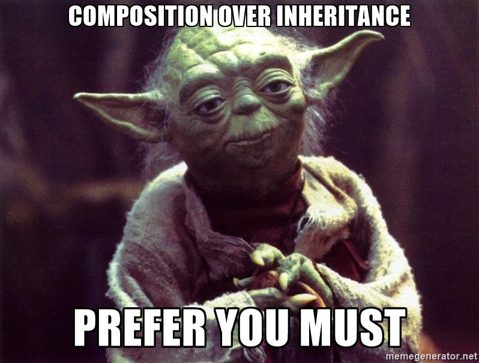

# Delegation

What is delegation?  


- Regular world
    - Making someone else do it! :)
- Computer Science
   - Make another Object do it
   
```java
public class Thing implements Something {
    
    Thing2 thing2;
    
    @Override
    public void doSomething() {
        thing2.doSomething();
    }
} 
```
  
## Composition and Aggregation 
 
 
 
 
 Have you heard of [Composition Over Inheritance](https://en.wikipedia.org/wiki/Composition_over_inheritance )?  
 
 This is basically the concept of holding a reference to an object and forwarding calls through it instead of inheriting from object directly. 
 
 Aggregation similarly is the concept of holding many references to objects that we forward calls to.
 
 Sound familiar?  Yep this is **delegation** in a nutshell.
 
 Why is this useful?  
 - In inheritance, many times the child object doesn't truly fit the "IS A" relationship of the parent
   
 - Child classes can break parent assumptions if not carefully designed for inheritance
   - For example: All unit tests run on the parent, should also pass on the child.
   - A improperly overridden method could break that contract!
   
   
 ## How in Java
 
 ```java

public interface Something {
    void doSomething();
}

public class Thing2 implements Something {
    @Override
    public void doSomeThing() {
        // Cool stuff
    }
}

public class Thing implements Something {
    
    Thing2 thing2;
    
    @Override
    public void doSomething() {
        thing2.doSomething();
    }
} 
```
 
 In Java you have to manually tie up all the call fowarding to the delegates similar to what is shown in `doSomething()` 
 above.  For one method this is probably fine, but it quickly grows O(N) by the number of methods we'd like to forward
 
 
 ## How in Kotlin
 
 ```kotlin
interface Something {
    fun doSomething()
}

class Thing2 : Something {
    override fun doSomething() {
        // Cool stuff
    }
}

class Thing: Something by Thing2 

```

Note how `Thing` is written in only 1 line of code, but contains all the functionality of `Thing2`!!!


### Challenges

- For class delegation the "delegated to" class must implement an interface
   -  Without source code this can be challenging
   - You can still do so with minimal manual code in `Kotlin`
-  With source code if you want to forward all `get` and `set` for properties you can run into naming conflicts etc
  - It's better to probably make methods that perform higher level actions in the interface if possible (instead of low level `get` and `set`)
  

# Property Delegates

In short:  Run some custom code on property set and get

## Use Cases

### Lazy Properties: 
  - the value gets computed only upon first access;
  
```kotlin
class AccountEntityDTO(accountEntityDO: AccountEntityDO) :
    AccountInterface by accountEntityDO {

    var expensiveFunctionRan = false

    // This will not execute expensiveFunction() until someLazyValue
    //   is accessed!
    val someLazyValue by lazy {
        expensiveFunction()
    }

    fun expensiveFunction() : Int {

        expensiveFunctionRan = true
        // Some expensive calculation
        return 5
    }

}
```
  
### Observable Properties
  - listeners get notified about changes to this property;
  
```kotlin
/**
 *  Example of observer pattern, simplified
 *
 *  Every time value changes, ProcessEvent() will be called!
 */
class System {
    var value: Int by Delegates.observable(0) {
        prop, old, new ->
        processEvent(Event(name = "value changed to: $new"))
    }

    private fun processEvent(event: Event) {

        event.process()
        println(event.name)
    }
}
```
### Storing Properties In a `Map`
   - Everytime a property backed by the `Map` delegate changes, it's updated in the `Map`
   - Data is stored in the variable AND in the `map`, redundantly.
   
   
 ```kotlin
class User(val map: Map<String, Any?>) {
    val name: String by map
    val age: Int     by map
}
```

Usage
```kotlin
val user = User(mapOf(
    "name" to "John Doe",
    "age"  to 25
))
```

Or how about this cleaner version?:

```kotlin
class MutableUser(val map: MutableMap<String, Any?>) {
    var name: String by map
    var age: Int     by map
}
```

Usage
```kotlin
 val user = User(HashMap())
 user.name = "Bob"
 user.age = 10
```

# Exercises Time


_____________
- Add a `DigBehavior` to `Monster` class
- TODO Add a observer Delegate to all name changes in `AccountEntityDO.name` (See PropertyDelegates for hints)
